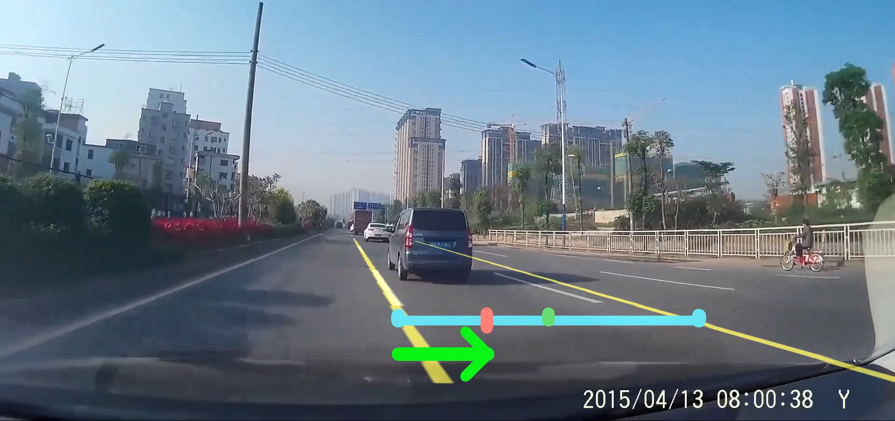

# Lane-Detector-and-Departure-Prewarning-System
# README

--------------------------------------------------------------------------------------------
## Method

### Using Simple Hough Transform and so on
--------------------------------------------------------------------------------------------
## Display of a shortcut of the output video


--------------------------------------------------------------------------------------------
## A: WEB application as followed
--------------------------------------------------------------------------------------------
### 0 |   activate running environment and install necessary packages firstly
```cmd
activate [-environment] # python environment, for axample: base
pip install -r requirements.txt
```

### 1 |   use CMD under the same road as myServer.py
```cmd
python myServer.py
```

### 2 |   please ensure `.mp4` file under the same location as `myServer.py` file 

### 3 |   use new CMD open ./templates/index-dp.html as before
```cmd
start chrome.exe http://127.0.0.1:5000/
```
--------------------------------------------------------------------------------------------
## B: GUI application as followed
--------------------------------------------------------------------------------------------
### 0 |   activate running environment and install necessary packages firstly
```cmd
activate [-environment] # python environment, for axample: base
pip install -r requirements.txt
```

### 1 |   please ensure  `.mp4` file under the same location as `gui.py` file 

### 2 |   use CMD under the same road as gui.py
```cmd
python gui.py
```
--------------------------------------------------------------------------------------------
## The `data_Trim.mp4` as test file has been uploaded onto Wiki.
## Oh, I'm so sorry that I personally cannot upload the testvideo `data_Trim.mp4`...
